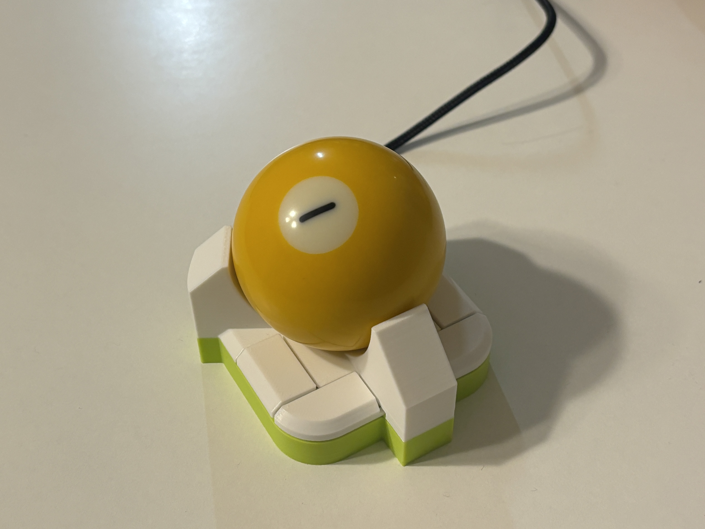
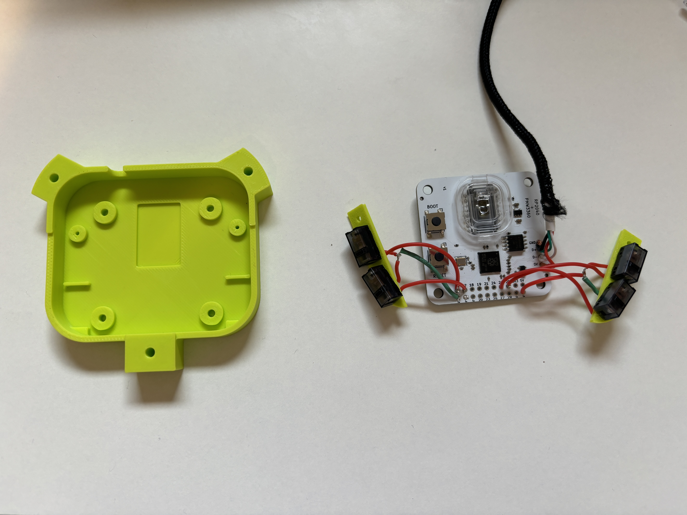
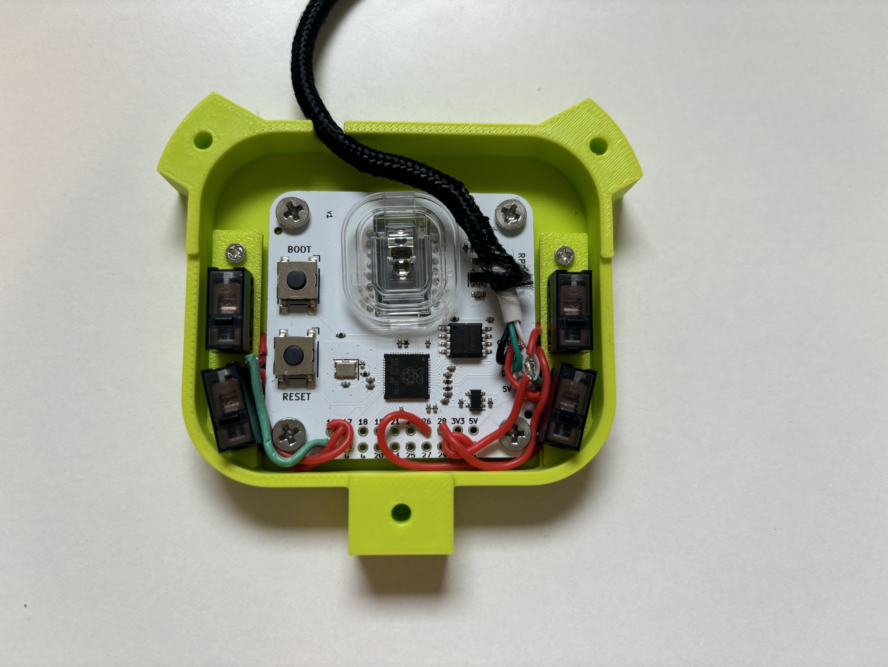

# ballin

**An open-source 4-button USB trackball powered by the RP2040.**



Uses [Jacek Fedorynski's](https://github.com/jfedor2) original PMW3360 trackball firmware and PCB [RP2040+PMW3360](https://github.com/jfedor2/rp2040-pmw3360)

3D models remixed from [here](https://www.printables.com/model/267954-trackball-15de/comments)

The four buttons map to Left Mouse Button, Right Mouse Button, Mouse 4, and Mouse 5. The original model only had 2 buttons, which was not adequate to implement scrolling and swiping functionality on top of the basic left and right clicking.

With the addition of two other buttons, you can map software on your computer to enable scrolling and swiping behaviors when you hold certain mouse buttons. I'm personally a fan of using [Mac Mouse Fix](https://github.com/noah-nuebling/mac-mouse-fix) on all my Mac computers to map Mouse 5 to scrolling when dragged, and Mouse 4 to the 3 fingered swipe that allows you to switch between desktops and spaces and mission control. 

Alternatively, if you want hardware scrolling programmed on the trackball instead of your computer, you can also modify the source code for the trackball. 

## Fabrication
Requires:

- 57.2mm billiard ball
- PMW3360 optical sensor
- PCB from here: https://github.com/jfedor2/rp2040-pmw3360
- 4 micro switches for mice
- 3 2.5mm zirconium oxide (or silicon nitride) bearing balls
- 2 M2x5 screws for securing the switch plates to base 
- 4 M3x4 screws for securing PCB to base
- 3 M3x12 flat head screws
- USB cable *Note: this should be a USB-A cable with the standard 4 wires. Using a USB-C cable might work, but since USB-C generally relies on a handshake before providing power, the trackball would not directly work if you plugged it into your computer with a USB-C cord unless you have a dongle in between.*

### 3D printing
I 3D printed the parts at .20 layer height, no supports needed. I used 40% sparse infill for the top part to get some rigidity and heft. The base I printed at standard 15% sparse infill. 

For the plates that hold the micro switchees, depending on your 3D printer's tolerances, the holes might not be big enough to fit the micro switch legs. I would suggest to first try widening them with some tweezers, if that doesn't work, adjust the X-Y hole compensation by + .1mm maybe. It's better for the holes to be tight and grip onto the switches well than to be too loose and have your switches wobble around. 

### Soldering button pins
Another thing to note is which pins on the PCB you solder your mouse buttons to. In the current compiled trackball.uf2, I have the pins for the buttons defined as thus below. If you use different pins, you would need to modify this code in [code/src/trackball.c](https://github.com/SamIAm2000/ballin-rp2040-trackball/blob/main/code/src/trackball.c)
```
#define TOP_LEFT 16 // Mouse 5
#define TOP_RIGHT 28 // Mouse 4
#define BOTTOM_LEFT 17 // Mouse 1
#define BOTTOM_RIGHT 26 // Mouse 2
```





## Compilation

You need Python and CMake installed. 

Once you've cloned this repository, run these commands in the ./code folder to create a build directory and compile.
```
mkdir build
cd build
cmake ..
make
```
The compiled file will be the `trackball.uf2` in the ./code/build/ folder.

## Flashing
To upload the compiled trackball.uf2 file from your computer to the trackball, plug in the USB cable from the trackball into your computer and hold boot, then press reset, then let go of both buttons. The trackball should appear in your list of devices. Drag and drop the .uf2 file on to the trackball.

## Demo
https://github.com/user-attachments/assets/3003e133-2ebc-4bb3-9a59-b019c4e8687f

